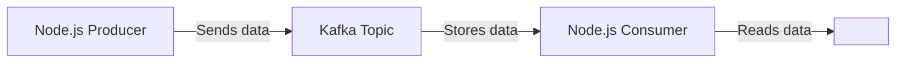

# Kafka Overview

**Kafka** is a high-throughput, distributed messaging system used for:

- **Real-time data pipelines**
- **Event-driven microservices**
- **Logging, monitoring, and analytics**
- **High-volume message processing**

Kafka is extremely fast, scalable, and reliable compared to traditional message queues.

## Real-Life Usage Example

### 🛒 E-Commerce Application (Amazon-like Scenario)

When a customer places an order:

1. **Order Service** sends an `order_created` event to Kafka.
2. **Inventory Service** consumes the event and reduces stock.
3. **Payment Service** processes the payment.
4. **Email Service** sends a confirmation email.
5. **Analytics Service** logs the event for reporting.

All these services remain **decoupled**, **scalable**, and process events in **real time** thanks to Kafka.

---

## 🏗️ Architecture Overview

- **Producer** → **Kafka Topic** → **Consumer**
- **Kafka Broker** stores topics and partitions
- **Zookeeper** (or **KRaft** in newer versions) coordinates the cluster

---

## Core Kafka Components

| Component        | Description                                                                 |
|------------------|-----------------------------------------------------------------------------|
| **Producer**     | Publishes events/messages to topics                                          |
| **Consumer**     | Subscribes and reads events from topics                                     |
| **Topic**        | Named stream/category of messages (e.g., orders, notifications)             |
| **Partitions**   | Topics are split for scaling and parallel processing                        |
| **Broker**       | Kafka server storing topics and partitions                                  |
| **Consumer Group** | Multiple consumers working together to process a topic                    |
| **Zookeeper / KRaft** | Cluster coordination (Zookeeper for older, KRaft for newer Kafka)      |

---

## How Kafka Works

- Kafka uses a **publish–subscribe** model:
    - A **producer** sends messages to a **topic**
    - A **consumer** reads messages from that topic
    - Kafka stores messages in **partitions**
    - Multiple Kafka servers (**brokers**) form a **cluster**
    - Messages are stored for a configurable time, allowing consumers to **replay** them

---
